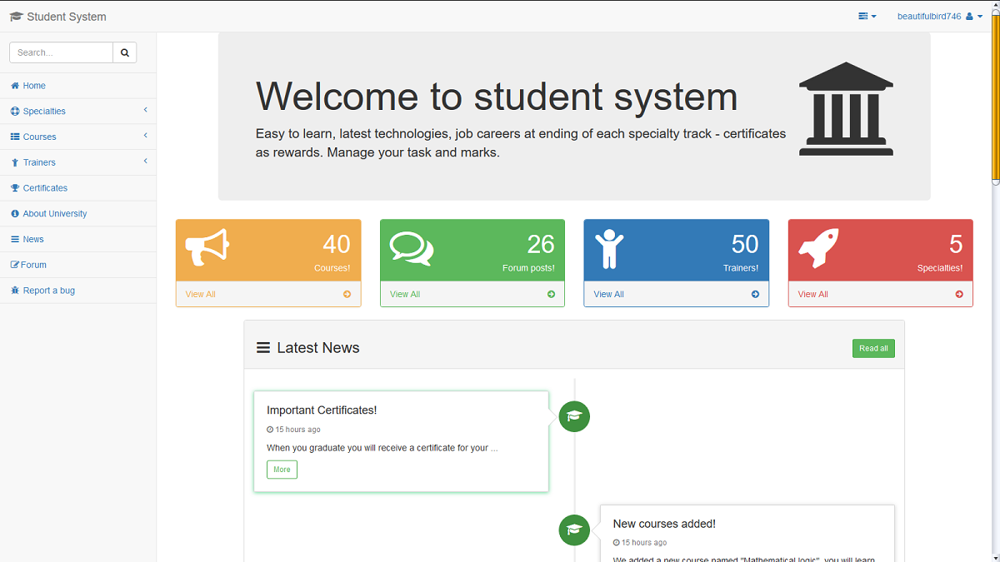
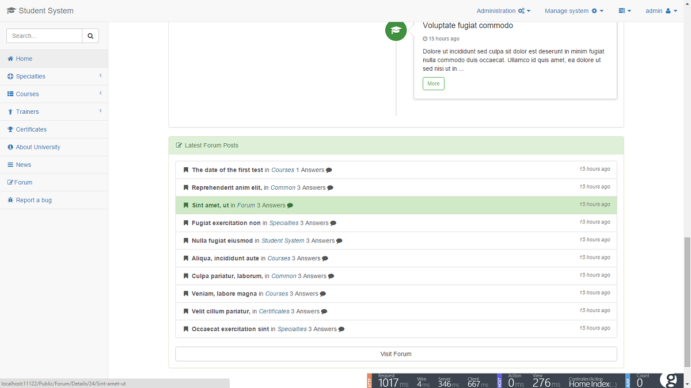
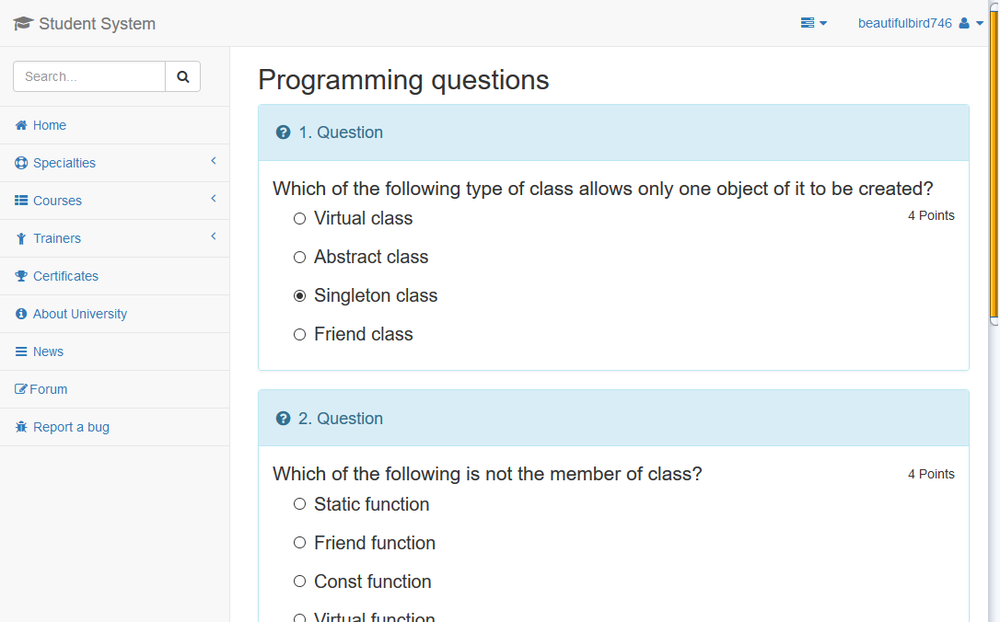
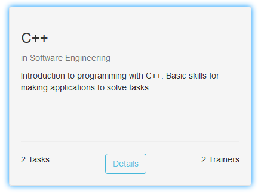
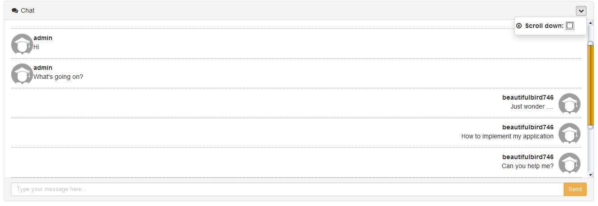
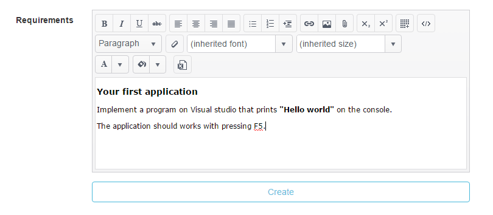
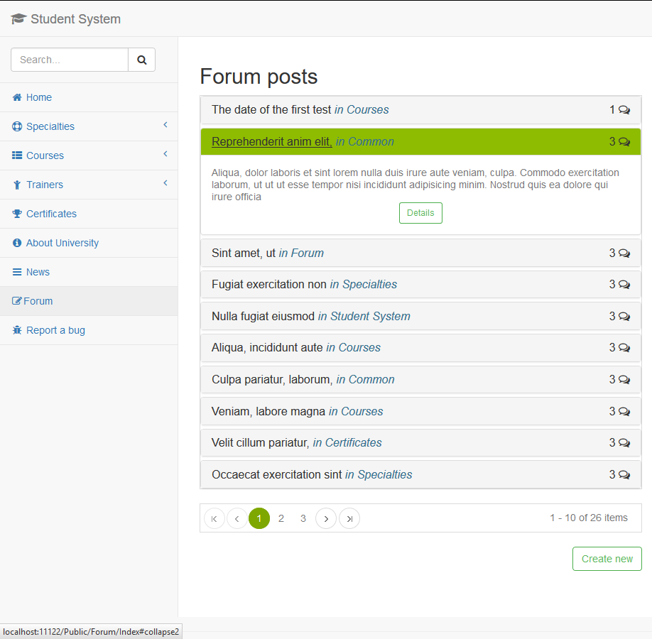
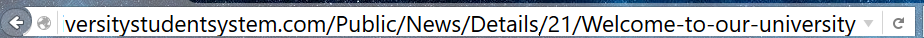
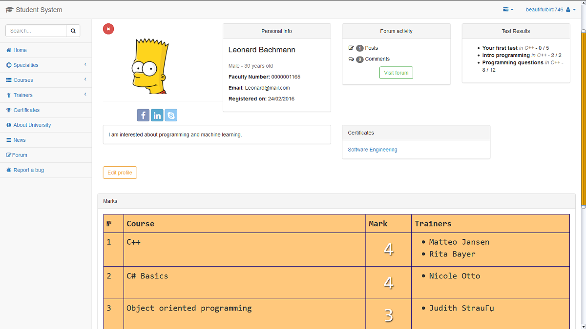

# UniversityStudentSystem
Students of the this system will have easy access to resources and information about education. 

## Setup project

You must have installed 

* .NET 4.6 Framework Installed
* ASP .NET
* SQL Server (Optional)
* Visual Studio 2015
* Set connections string in Web.config

To run the project without SQL Server

* Open the project in Visual Studio
* Expand Web folder and new Item in `UniversityStudentSystem.Web`
* The item must be added in _`App_Data`_ folder
* Right click, Add, New item, Click on Data category and select `SQL Server Database` **.mdf** file.
* Open `Server Explorer` tab in Visual studio
* Check `Database.mdf`, Right click properties
* Copy the connection string 
* Paste the connection string in Web.Config
* The above steps are already done (just to be described)

By default project will run with (local) database.mdf file, if you want to use SQL server just change the connection string.

**Run the project** through Visual Studio using **F5 or Ctrl + F5**

## Introduction 

* For seeding data are used `Lorem.NET` and [https://randomuser.me/](https://randomuser.me/) for random user data, news and forum content. You can check this [project](https://github.com/M-Yankov/RandomUserData) for gather users data 
* Technologies used
    * ASP.NET MVC 5
    * MS SQL Server (database)
* Components (packages)
    * Entity framework 6 - code first
    * Ninject - Dependency inversion
    * Automapper - binding models (database models to view models etc.)
    * Boostrap - for UI
    * Sb admin theme based on bootsrap - can be found here [http://startbootstrap.com/template-overviews/sb-admin/](http://startbootstrap.com/template-overviews/sb-admin/)
    * SinganlR - for the live chat
    * __Kendo UI MVC - If you want to run the project ensure you have installed Kendo UI MVC__  link: [Installation](http://docs.telerik.com/kendo-ui/aspnet-mvc/asp-net-mvc-5) 
    * Glimpse - statistics for the application (runs on admin account only)
    * JQuery 
* Users: by default accounts are configured to have password equal to the username. 
    * Some examples:
        * _username:_ admin _pass:_ admin
        * _username:_ beautifulbird746 _pass:_ beautifulbird746
* Required software - __Visual Studio 2015 with Update 1__
	* C# 6.0 is used. 	

## Start
* When application is ready. You should see this home page:

  

* Here are more screenshots from the application:
<table border="1">
    <tr>
        <td>
            
        </td>
        <td>
            
        </td>
        <td>
            
        </td>
    </tr>
    <tr>
        <td>
            
        </td>
        <td>
            
        </td>
        <td>
            
        </td>
    </tr>
</table>

* Friendly urls:
 

* _Note_: elements of the home page and the left side menu are cached for 10 min.
So if you add a new course check the all courses page. Same for the other component

* The application doesn't have some functionality for editing models (for example in the admin area). 

* __Profile page__ - on the profile page each user/student can check his marks, certifications, results from tests, comments and posts in the forum 
and the profile information: 

## The Life cycle of a student

* First of all registration. Then each student can apply a candidature for a specialty. Wait an approvement and can check your favorite courses. 
* Each course has task and tests. Solve them get good marks. 
* You can check your marks in the profile page.
* For solving the tasks for the course you should wrap all solutions in a single .zip archive less than 2Mb.
* If you want to get certificate you should study hard.
* Check out forum. You can make discussion with other students.
* If you found a bug in the system just go to the report page using the navigation menu.
* Follow our news about the university in the "News" section.
	
## Admins and trainers
	
* They should approve student candidatures.
* They can make a new courses.
* It's obligatory to upload resources about each courses. Students should have a way to learn from somewhere. 
* They should make tests to check knowledge of the students. 
* And finally give certificates to students in the specialty. 
	

<strong>This project is made for education purposes for the [Telerik Academy](http://telerikacademy.com/) ASP .NET MVC Course - Project</strong>
 

 If you find a bug, problem or something is not right - make a new issue on this <a href="https://github.com/M-Yankov/UniversityStudentSystem/issues/new/">page</a> .

